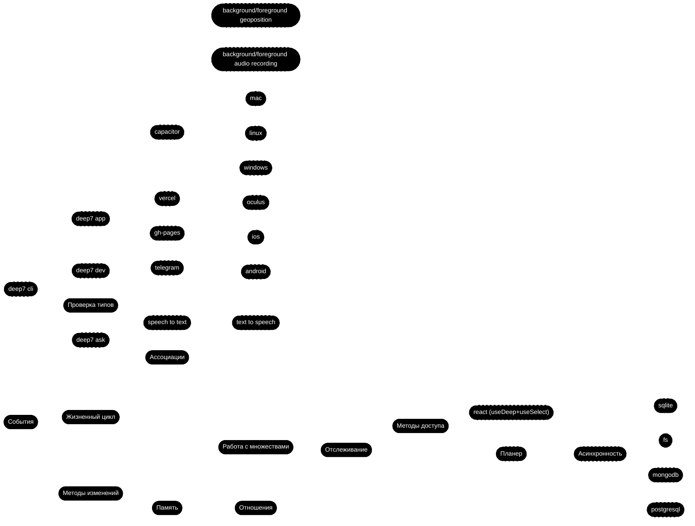

# Deep.js

## Документация

- [События (Events)](./EVENTS.md)
- [Память (Memory)](./MEMORY.md)
- [Ассоциации (Association)](./ASSOCIATION.md)
- [Жизненный цикл (Lifecycle)](./LIFECYCLE.md)
- [Проверка типов (Is)](./IS.md)
- [Методы доступа (Gets)](./GETS.md)
- [Методы изменений (Sets)](./SETS.md)
- [Работа с множествами (Many)](./MANY.md)
- [Отношения (Relations)](./RELATIONS.md)
- [Отслеживание (Track)](./TRACK.md)



## API

```mermaid
%%{init: {'theme':'dark', 'themeVariables': {'primaryColor':'#000000', 'primaryBorderColor':'#FFFFFF', 'primaryTextColor':'#FFFFFF', 'lineColor':'#FFFFFF'}, 'flowchart': {'diagramPadding': 8, 'htmlLabels': true, 'curve': 'basis'}, 'zoom': {'enabled': true, 'maxLevel': 10}}}%%
graph LR
    %% Центральный элемент
    DEEP(["deep()"]);

    %% Ассоциации
    ASS(["ass"]);

    %% Геттеры (проверка типов)
    IS(["is.js"]);
    IS1(["ass.isString"])
    IS2(["ass.isNumber"])
    IS3(["ass.isBoolean"])
    IS4(["ass.isArray"])
    IS5(["ass.isObject"])
    IS6(["ass.isFunction"])
    IS7(["ass.isNull"])
    IS8(["ass.isUndefined"])
    IS9(["ass.isSymbol"])
    IS10(["ass.isBigInt"])
    IS11(["ass.isDate"])
    IS12(["ass.isRegExp"])
    IS13(["ass.isSet"])
    IS14(["ass.isMap"])
    IS15(["ass.isPromise"])
    IS16(["ass.isError"])
    IS17(["ass.isJSON"])
    IS18(["ass.isEmpty"])
    IS19(["ass.isMany"])
    IS20(["ass.isPlainObject"])

    %% Методы доступа
    GETS(["gets.js"]);
    GET1(["ass.get(key)"])
    GET2(["ass.keys()"])
    GET3(["ass.values()"])
    GET4(["ass.entries()"])
    GET5(["ass.forEach((v, k) => {})"])
    GET6(["ass.map((v, k) => {})"])
    GET7(["ass.filter((v, k) => {})"])
    GET8(["ass.find((v, k) => {})"])
    GET9(["ass.reduce((acc, v, k) => {}, init)"])

    %% Методы изменений
    SETS(["sets.js"]);
    SET1(["ass.set(key, value)"])
    SET2(["ass.add(value)"])
    SET3(["ass.delete(key)"])
    SET4(["ass.remove(value)"])
    SET5(["ass.push(...values)"])
    SET6(["ass.pop()"])
    SET7(["ass.shift()"])
    SET8(["ass.unshift(...values)"])

    %% Работа с множествами
    MANY(["many.js"]);
    MANY1(["ass.difference(set)"])
    MANY2(["ass.intersection(set)"])
    MANY3(["ass.symmetricDifference(set)"])
    MANY4(["ass.union(set)"])

    %% События
    EVENTS(["events.js"]);
    EV1(["ass.on(event, callback)"])
    EV2(["ass.once(event, callback)"])
    EV3(["ass.off(event, callback)"])
    EV4(["ass.emit(event, data)"])

    %% Отслеживание
    TRACK(["track.js"]);
    TR1(["ass.track"])
    TR2(["ass.origins"])

    %% Жизненный цикл
    LIFECYCLE(["lifecycle.js"]);
    LC1(["ass.onNew(callback)"])
    LC2(["ass.onKill(callback)"])

    %% Отношения
    RELATIONS(["relations.js"]);
    REL1(["ass.type = Type"])
    REL2(["ass.from = Source"])
    REL3(["ass.to = Target"])
    REL4(["ass.in"])
    REL5(["ass.out"])

    %% Методы преобразования
    ASSJS(["association.js"]);
    CONV1(["ass.valueOf()"])
    CONV2(["ass.toString()"])
    CONV3(["ass.toUpperCase()"])
    CONV4(["ass.toLowerCase()"])
    CONV5(["ass.toUpperCaseFirst()"])
    CONV6(["ass.toLowerCaseFirst()"])
    CONV7(["ass.toFixed(digits)"])
    CONV8(["ass.toJSON(space)"])

    %% Стили для групп
    style ASS fill:#000000,stroke:#FFFFFF,stroke-width:2px,color:#FFFFFF
    style IS fill:#000000,stroke:#FFFFFF,stroke-width:2px,color:#FFFFFF
    style GETS fill:#000000,stroke:#FFFFFF,stroke-width:2px,color:#FFFFFF
    style SETS fill:#000000,stroke:#FFFFFF,stroke-width:2px,color:#FFFFFF
    style MANY fill:#000000,stroke:#FFFFFF,stroke-width:2px,color:#FFFFFF
    style EVENTS fill:#000000,stroke:#FFFFFF,stroke-width:2px,color:#FFFFFF
    style TRACK fill:#000000,stroke:#FFFFFF,stroke-width:2px,color:#FFFFFF
    style LIFECYCLE fill:#000000,stroke:#FFFFFF,stroke-width:2px,color:#FFFFFF
    style RELATIONS fill:#000000,stroke:#FFFFFF,stroke-width:2px,color:#FFFFFF
    style ASSJS fill:#000000,stroke:#FFFFFF,stroke-width:2px,color:#FFFFFF

    %% Стили для методов
    style IS1 fill:#000000,stroke:#FFFFFF,stroke-width:2px,color:#FFFFFF
    style IS2 fill:#000000,stroke:#FFFFFF,stroke-width:2px,color:#FFFFFF
    style IS3 fill:#000000,stroke:#FFFFFF,stroke-width:2px,color:#FFFFFF
    style IS4 fill:#000000,stroke:#FFFFFF,stroke-width:2px,color:#FFFFFF
    style IS5 fill:#000000,stroke:#FFFFFF,stroke-width:2px,color:#FFFFFF
    style IS6 fill:#000000,stroke:#FFFFFF,stroke-width:2px,color:#FFFFFF
    style IS7 fill:#000000,stroke:#FFFFFF,stroke-width:2px,color:#FFFFFF
    style IS8 fill:#000000,stroke:#FFFFFF,stroke-width:2px,color:#FFFFFF
    style IS9 fill:#000000,stroke:#FFFFFF,stroke-width:2px,color:#FFFFFF
    style IS10 fill:#000000,stroke:#FFFFFF,stroke-width:2px,color:#FFFFFF
    style IS11 fill:#000000,stroke:#FFFFFF,stroke-width:2px,color:#FFFFFF
    style IS12 fill:#000000,stroke:#FFFFFF,stroke-width:2px,color:#FFFFFF
    style IS13 fill:#000000,stroke:#FFFFFF,stroke-width:2px,color:#FFFFFF
    style IS14 fill:#000000,stroke:#FFFFFF,stroke-width:2px,color:#FFFFFF
    style IS15 fill:#000000,stroke:#FFFFFF,stroke-width:2px,color:#FFFFFF
    style IS16 fill:#000000,stroke:#FFFFFF,stroke-width:2px,color:#FFFFFF
    style IS17 fill:#000000,stroke:#FFFFFF,stroke-width:2px,color:#FFFFFF
    style IS18 fill:#000000,stroke:#FFFFFF,stroke-width:2px,color:#FFFFFF
    style IS19 fill:#000000,stroke:#FFFFFF,stroke-width:2px,color:#FFFFFF
    style IS20 fill:#000000,stroke:#FFFFFF,stroke-width:2px,color:#FFFFFF

    style GET1 fill:#000000,stroke:#FFFFFF,stroke-width:2px,color:#FFFFFF
    style GET2 fill:#000000,stroke:#FFFFFF,stroke-width:2px,color:#FFFFFF
    style GET3 fill:#000000,stroke:#FFFFFF,stroke-width:2px,color:#FFFFFF
    style GET4 fill:#000000,stroke:#FFFFFF,stroke-width:2px,color:#FFFFFF
    style GET5 fill:#000000,stroke:#FFFFFF,stroke-width:2px,color:#FFFFFF
    style GET6 fill:#000000,stroke:#FFFFFF,stroke-width:2px,color:#FFFFFF
    style GET7 fill:#000000,stroke:#FFFFFF,stroke-width:2px,color:#FFFFFF
    style GET8 fill:#000000,stroke:#FFFFFF,stroke-width:2px,color:#FFFFFF
    style GET9 fill:#000000,stroke:#FFFFFF,stroke-width:2px,color:#FFFFFF

    style SET1 fill:#000000,stroke:#FFFFFF,stroke-width:2px,color:#FFFFFF
    style SET2 fill:#000000,stroke:#FFFFFF,stroke-width:2px,color:#FFFFFF
    style SET3 fill:#000000,stroke:#FFFFFF,stroke-width:2px,color:#FFFFFF
    style SET4 fill:#000000,stroke:#FFFFFF,stroke-width:2px,color:#FFFFFF
    style SET5 fill:#000000,stroke:#FFFFFF,stroke-width:2px,color:#FFFFFF
    style SET6 fill:#000000,stroke:#FFFFFF,stroke-width:2px,color:#FFFFFF
    style SET7 fill:#000000,stroke:#FFFFFF,stroke-width:2px,color:#FFFFFF
    style SET8 fill:#000000,stroke:#FFFFFF,stroke-width:2px,color:#FFFFFF

    style MANY1 fill:#000000,stroke:#FFFFFF,stroke-width:2px,color:#FFFFFF
    style MANY2 fill:#000000,stroke:#FFFFFF,stroke-width:2px,color:#FFFFFF
    style MANY3 fill:#000000,stroke:#FFFFFF,stroke-width:2px,color:#FFFFFF
    style MANY4 fill:#000000,stroke:#FFFFFF,stroke-width:2px,color:#FFFFFF

    style EV1 fill:#000000,stroke:#FFFFFF,stroke-width:2px,color:#FFFFFF
    style EV2 fill:#000000,stroke:#FFFFFF,stroke-width:2px,color:#FFFFFF
    style EV3 fill:#000000,stroke:#FFFFFF,stroke-width:2px,color:#FFFFFF
    style EV4 fill:#000000,stroke:#FFFFFF,stroke-width:2px,color:#FFFFFF

    style TR1 fill:#000000,stroke:#FFFFFF,stroke-width:2px,color:#FFFFFF
    style TR2 fill:#000000,stroke:#FFFFFF,stroke-width:2px,color:#FFFFFF

    style LC1 fill:#000000,stroke:#FFFFFF,stroke-width:2px,color:#FFFFFF
    style LC2 fill:#000000,stroke:#FFFFFF,stroke-width:2px,color:#FFFFFF

    style REL1 fill:#000000,stroke:#FFFFFF,stroke-width:2px,color:#FFFFFF
    style REL2 fill:#000000,stroke:#FFFFFF,stroke-width:2px,color:#FFFFFF
    style REL3 fill:#000000,stroke:#FFFFFF,stroke-width:2px,color:#FFFFFF
    style REL4 fill:#000000,stroke:#FFFFFF,stroke-width:2px,color:#FFFFFF
    style REL5 fill:#000000,stroke:#FFFFFF,stroke-width:2px,color:#FFFFFF

    style CONV1 fill:#000000,stroke:#FFFFFF,stroke-width:2px,color:#FFFFFF
    style CONV2 fill:#000000,stroke:#FFFFFF,stroke-width:2px,color:#FFFFFF
    style CONV3 fill:#000000,stroke:#FFFFFF,stroke-width:2px,color:#FFFFFF
    style CONV4 fill:#000000,stroke:#FFFFFF,stroke-width:2px,color:#FFFFFF
    style CONV5 fill:#000000,stroke:#FFFFFF,stroke-width:2px,color:#FFFFFF
    style CONV6 fill:#000000,stroke:#FFFFFF,stroke-width:2px,color:#FFFFFF
    style CONV7 fill:#000000,stroke:#FFFFFF,stroke-width:2px,color:#FFFFFF
    style CONV8 fill:#000000,stroke:#FFFFFF,stroke-width:2px,color:#FFFFFF

    %% Стиль для центрального элемента
    style DEEP fill:#000000,stroke:#FFFFFF,stroke-width:2px,color:#FFFFFF

    %% Связи с центральным элементом
    DEEP --> ASS;

    %% Связи от ассоциаций к группам (пунктирные)
    ASS -.-> IS;
    ASS -.-> GETS;
    ASS -.-> SETS;
    ASS -.-> MANY;
    ASS -.-> EVENTS;
    ASS -.-> TRACK;
    ASS -.-> LIFECYCLE;
    ASS -.-> RELATIONS;

    %% Связи от групп к методам
    IS --> IS1;
    IS --> IS2;
    IS --> IS3;
    IS --> IS4;
    IS --> IS5;
    IS --> IS6;
    IS --> IS7;
    IS --> IS8;
    IS --> IS9;
    IS --> IS10;
    IS --> IS11;
    IS --> IS12;
    IS --> IS13;
    IS --> IS14;
    IS --> IS15;
    IS --> IS16;
    IS --> IS17;
    IS --> IS18;
    IS --> IS19;
    IS --> IS20;

    GETS --> GET1;
    GETS --> GET2;
    GETS --> GET3;
    GETS --> GET4;
    GETS --> GET5;
    GETS --> GET6;
    GETS --> GET7;
    GETS --> GET8;
    GETS --> GET9;

    SETS --> SET1;
    SETS --> SET2;
    SETS --> SET3;
    SETS --> SET4;
    SETS --> SET5;
    SETS --> SET6;
    SETS --> SET7;
    SETS --> SET8;

    MANY --> MANY1;
    MANY --> MANY2;
    MANY --> MANY3;
    MANY --> MANY4;

    EVENTS --> EV1;
    EVENTS --> EV2;
    EVENTS --> EV3;
    EVENTS --> EV4;

    TRACK --> TR1;
    TRACK --> TR2;

    LIFECYCLE --> LC1;
    LIFECYCLE --> LC2;

    RELATIONS --> REL1;
    RELATIONS --> REL2;
    RELATIONS --> REL3;
    RELATIONS --> REL4;
    RELATIONS --> REL5;

    %% Методы преобразования
    ASS -.-> ASSJS;
    ASSJS --> CONV1;
    ASSJS --> CONV2;
    ASSJS --> CONV3;
    ASSJS --> CONV4;
    ASSJS --> CONV5;
    ASSJS --> CONV6;
    ASSJS --> CONV7;
    ASSJS --> CONV8;

    %% Стиль для association.js
    style ASSJS fill:#000000,stroke:#FFFFFF,stroke-width:2px,color:#FFFFFF
```



Проект Deep версии 7.2.0 на чистом JavaScript

## Установка


```bash
npm install deep7
```

Или

```bash
# Клонирование репозитория
git clone <repository-url>
cd deep
npm ci
```

## Подключение

```js
import deep from 'deep7';
```

> Пока мы не пишем продолжение файла, до особых распоряжений, только редактируем радел # Документация
